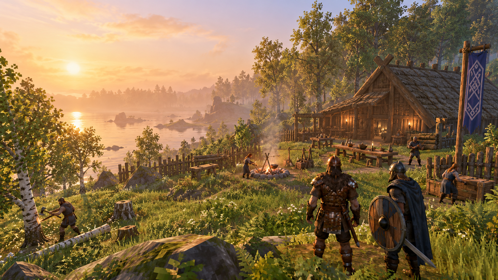
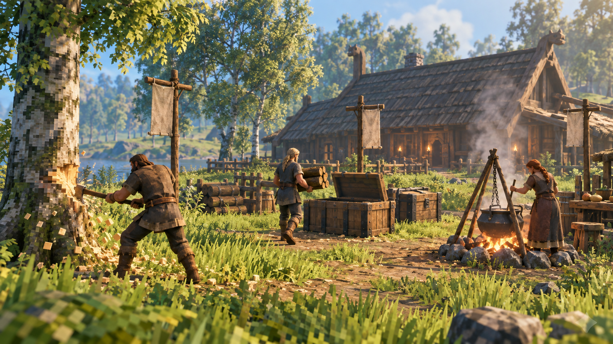
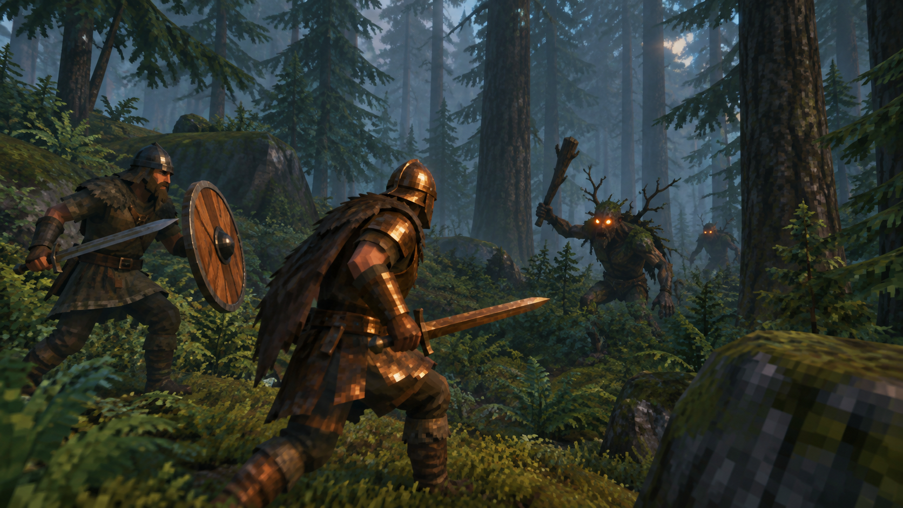
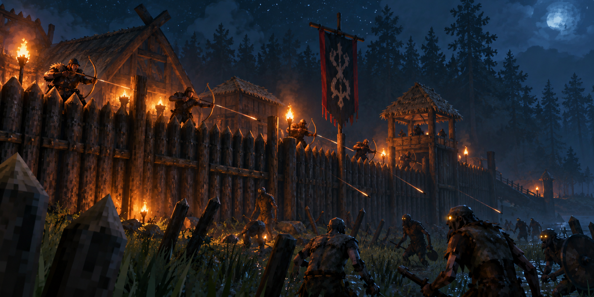
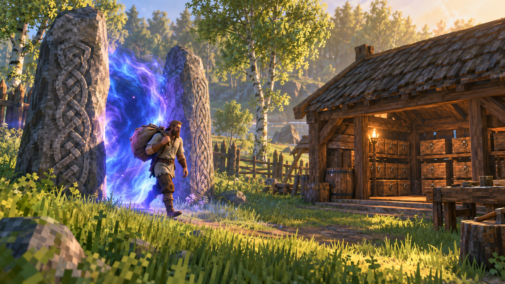

# Age of Jarls — mod do Valheim



**Osady, osadnicy, praca, oblężenia i zarządzanie w co-op.** Ratujesz wikingów z obozów wrogów, osiedlasz ich przy
Stole Jarla, dajesz im pracę przez Totemy Zadań, karmisz z Kotła Osady i razem ze znajomym bronisz osady przed
oblężeniami. Osadnik, który za tobą idzie, jest twoim strażnikiem.

| | |
|---|---|
| **Pobierz (najnowsza wersja)** | **https://aoj-updates.pages.dev** — jeden klik, zip gotowy do rozpakowania |
| Thunderstore (r2modman / Mod Manager) | https://thunderstore.io/c/valheim/p/Dismonder/AgeOfJarls/ |
| Wydania na GitHub | https://github.com/Dismonder/AgeOfJarls/releases/latest |
| Lista zmian | [mods/AgeOfJarls/Package/CHANGELOG.md](mods/AgeOfJarls/Package/CHANGELOG.md) |
| Opis dla graczy (EN) | [mods/AgeOfJarls/Package/README.md](mods/AgeOfJarls/Package/README.md) |
| Dokumentacja projektu (PL) | [docs/AgeOfJarls](docs/AgeOfJarls/README.md) — koncepcja, funkcje, architektura, plan |

Wymagania: Valheim 1.0.x, [BepInEx 5](https://thunderstore.io/c/valheim/p/denikson/BepInExPack_Valheim/),
[Jotunn](https://thunderstore.io/c/valheim/p/ValheimModding/Jotunn/). Gra solo, co-op i serwer dedykowany.
**Wszyscy na serwerze muszą mieć tę samą wersję moda** — gra odrzuca połączenie przy różnicy.

> **Zalecany mod: [Mod Menu](mods/ModMenu/Package/README.md)** ([Thunderstore](https://thunderstore.io/c/valheim/p/Dismonder/ModMenu/),
> [GitHub](https://github.com/Dismonder/ModMenu/releases/latest)) — przycisk **Mody** w menu głównym:
> ustawienia Age of Jarls (i każdego innego moda) w wygodnym oknie zamiast grzebania w pliku `.cfg`, włączanie i
> wyłączanie modów bez ruszania plików (działa z Vortexem i r2modman), profile modów i sprawdzanie aktualizacji
> (Nexus, Thunderstore). Tylko po stronie klienta — kolega na serwerze nie musi go mieć.

| | |
|---|---|
|  **Praca** — drwal, tragarz, kucharz; zapasy w zwykłych skrzyniach |  **Strażnik** — osadnik, który za tobą idzie, trzyma się za ramieniem i broni cię |
|  **Oblężenia** — sztandary, alarm, łucznicy na murach |  **Portale** — osadnicy chodzą nimi sami, np. do magazynu z mapy |

## Instalacja (ręcznie)

1. Zainstaluj BepInEx 5 i Jotunn (najprościej przez r2modman / Thunderstore Mod Manager albo Vortex).
2. Pobierz `AgeOfJarls-<wersja>.zip` ze strony https://aoj-updates.pages.dev lub z wydań na GitHub.
3. Rozpakuj zip. Katalog `plugins/AgeOfJarls` wrzuć do `Valheim/BepInEx/plugins/`
   (powinien powstać `BepInEx/plugins/AgeOfJarls/AgeOfJarls.dll`).
4. Uruchom grę. Przy pierwszym starcie powstaje `BepInEx/config/com.Dismonder.AgeOfJarls.cfg` z opcjami.

Menedżer modów (r2modman): zip jest w formacie Thunderstore, więc „Import local mod” też działa.

## Automatyczne aktualizacje

Od wersji 0.7.0 mod sam sprawdza stronę https://aoj-updates.pages.dev w menu głównym gry. Gdy jest nowsza wersja,
pobiera ją, sprawdza sumę SHA-256 i podmienia pliki na następne uruchomienie gry; w grze pojawia się komunikat
„pobrane — uruchom grę ponownie”. Dzięki temu wszyscy na serwerze mają tę samą wersję. Wyłączenie:
`Updates/AutoUpdate = false` w pliku konfiguracji.

## Jak grać (skrót)

- **Stół Jarla** (młotek → Osada) zakłada osadę; jej promień i obszary widać na mapie (M).
- **Osadnicy**: uwolnij jeńców z obozów wrogów, przyprowadź ich do stołu i przyjmij. Każdy ma imię, cechy, potrzeby.
- **Praca**: Totemy Zadań (drwal, górnik, tragarz, hutnik, budowniczy, rolnik, kucharz); zapasy trafiają do zwykłych
  skrzyń. Na dużej mapie **Z** oznacza obszar osady, np. **magazyn** za portalem.
- **Rozkazy**: **H** patrząc na osadnika (do mnie, czekaj, atak, odwrót, do domu, okno), **G** = koło gry z rozkazami
  dla drużyny. Osadnik, który za tobą idzie, trzyma się za ramieniem, nie włazi w kamerę i broni cię; przechodzi
  z tobą przez portale.
- **Okno osadnika**: ekwipunek (daj/weź), rola bojowa, imię. **F6**: podręcznik w grze.
- **Obrona**: Sztandary Wojenne, Zbrojownia, alarm, oblężenia od 1. szczebla osady.

## Tryby gry

Ustawienie `General/Mode` w pliku konfiguracji (na serwerze decyduje host):

- **Chill** (domyślny): osadnik, któremu skończy się zdrowie, jest powalony i po chwili sam wstaje ze sprzętem.
- **Realistic**: powalony osadnik leży, dopóki ktoś nie pomoże mu wstać - Ty (**E**) albo inny osadnik z osady,
  który sam podbiegnie. Bez pomocy przez `Settlers/RescueMinutes` (domyślnie 10 min, czas świata - także we śnie)
  umiera, a sprzęt zostaje w grobie. Po najechaniu na niego widać, ile minut zostało. Pracownicy noszą najwyżej
  `Work/RealisticCarryLimit` (30) przedmiotów na jeden kurs.

## Dla modderów

Repozytorium to przestrzeń robocza (BepInEx 5 + Jotunn, .NET Framework 4.8):

```
dotnet build mods/AgeOfJarls            # build + kopia do BepInEx/plugins (gra musi być zamknięta)
dotnet test tests/AgeOfJarls.Tests      # testy formatów zapisu i reguł rang
pwsh -NoProfile -File tools/package.ps1 AgeOfJarls          # zip Thunderstore do dist/
pwsh -NoProfile -File tools/publish-update.ps1 AgeOfJarls   # zip + strona aktualizacji (Cloudflare Pages)
```

Ścieżkę gry nadpisuje `$env:VALHEIM_DIR`. Dekompilacja kodu gry do `_ref/`: `pwsh -NoProfile -File tools/decompile.ps1`
(katalog `_ref` nie trafia do repozytorium). Szczegóły: [docs/AgeOfJarls/architecture.md](docs/AgeOfJarls/architecture.md).

## Licencja

[MIT](LICENSE) — kod jest otwarty: można go czytać, wykorzystywać i zmieniać, z zachowaniem informacji o autorze.
